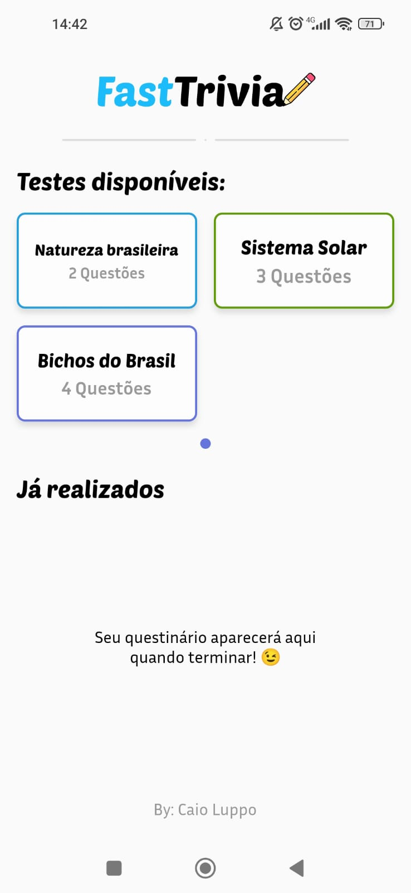
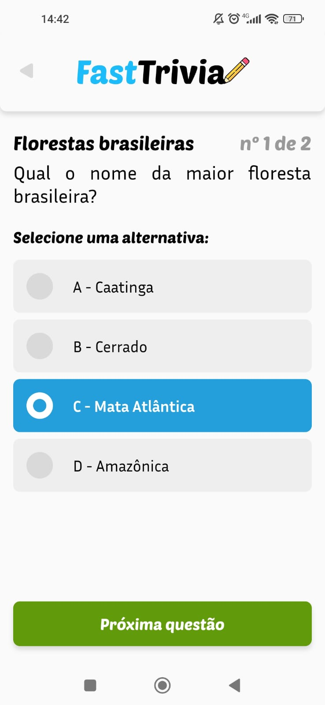
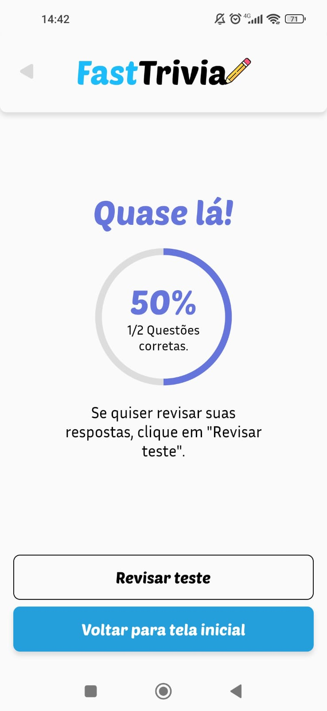
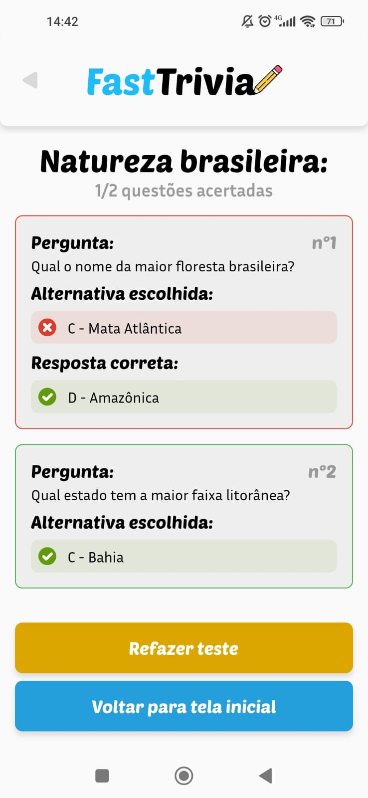
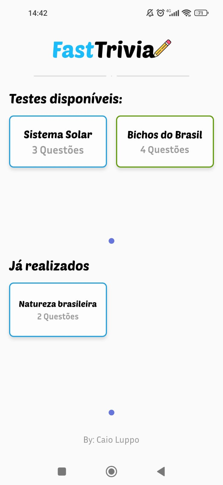

# FastTrivia 

**FastTrivia** é um app que pode ser **integrado com API** de questionários ou **quizzes**. Nele, o usuário abre uma lista de quizzes e pode responder e refazer os testes caso deseje.

## Tecnologias utilizadas 👩🏻‍💻

- Flutter
- Figma (UI/UX)
- Bibliotecas principais: MobX, Provider, SQFlite, Http e Mockito

## Mockito 👻
Dada a falta de uma API integrada por motivo de testes, foi utilizado o Mockito para **simular uma consulta à uma API** online que requisitava os Quizzes.

## Design 👨🏻‍🎨
O design do aplicativo foi feito na plataforma **Figma**, utilizando os conhecimentos adquiridos pelos cursos da Alura e pesquisas individuais.

Para ver o design, <a href="https://www.figma.com/file/LEbS6nYUkRvWRVuu6jSfew/Fast-Trivia?type=design&node-id=0-1&mode=design&t=w2yhP4ga7w2RIbn4-0">clique aqui</a>.

## Download e Links ⬇
**Download:** https://github.com/CaioLuppo/fast_trivia/releases

Linkedin: https://linkedin.com/in/CaioLuppo  **#OpenToWork** ✌🏻
